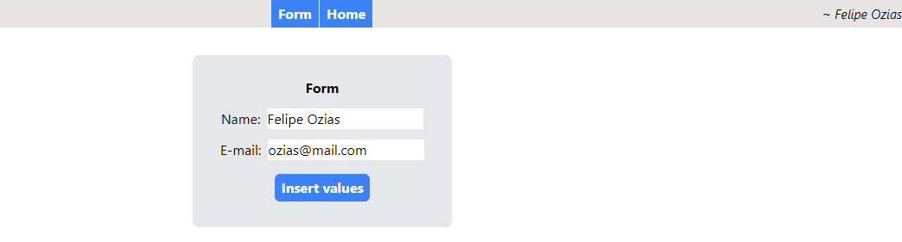
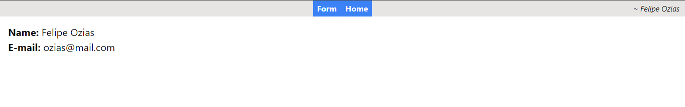

# Aplication React + Redux
🔰Fill in the fields and click "Insert values" in the Form and view the value in Home, the values ​​were shared via redux

*form*


*home*

# Getting started

## Recommended IDE Configuration
[VSCode](https://code.visualstudio.com/) + [TypeScript]

## Prerequisites

- [Yarn](https://classic.yarnpkg.com/lang/en/docs/install)

## *Project Setup*

```sh
yarn install
```

## *Start the local dev environment*

```
yarn start
```

Runs the app in the development mode.\
Open [http://localhost:3000](http://localhost:3000) to view it in the browser.

## *Compile and Minify for Production*

```sh
yarn build
```